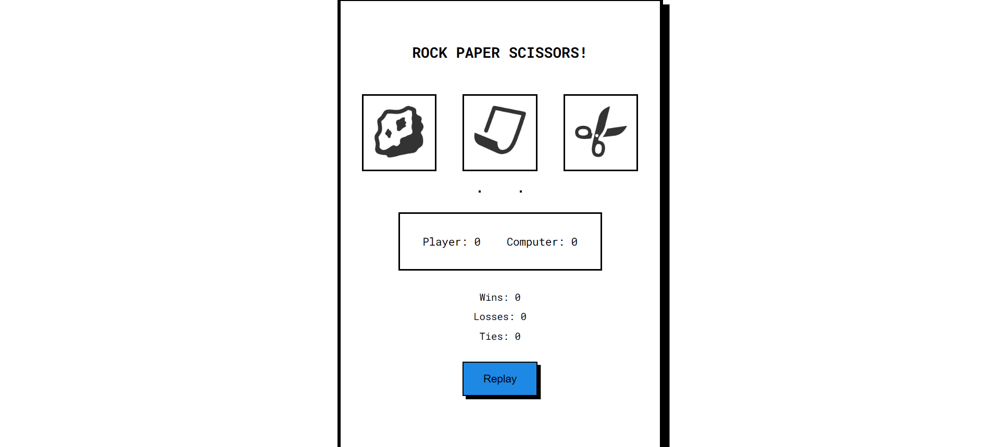

# Neo RPS - Rock Paper Scissors

A fun and interactive **Rock Paper Scissors** game with a **cartoonish animated UI**. Built using **HTML, CSS, and JavaScript**, this game provides an engaging experience with smooth transitions, win/loss tracking, and responsive design.

## 🖼️ Preview
  

## 🚀 Features
- **Player vs. Computer Mode** – Challenge the computer in an exciting match.
- **Cartoonish Animated UI** – Play with a vibrant and dynamic design.
- **Win/Loss/Tie Announcements** – Displays results after each round.
- **Scoreboard Tracking** – Keeps track of player and computer scores.
- **Game Rounds Option** – Choose the number of rounds to play.
- **Replay Button** – Easily restart the game at any time.
- **Smooth & Responsive Transitions** – Works seamlessly on all screen sizes.

## 📜 Instructions
- Click **Rock, Paper, or Scissors** to make your move.
- The computer selects a random choice.
- The game determines the winner based on classic rules:
  - Rock beats Scissors
  - Scissors beats Paper
  - Paper beats Rock
- The result is displayed along with the updated score.
- Click **Replay** to start a new round.
